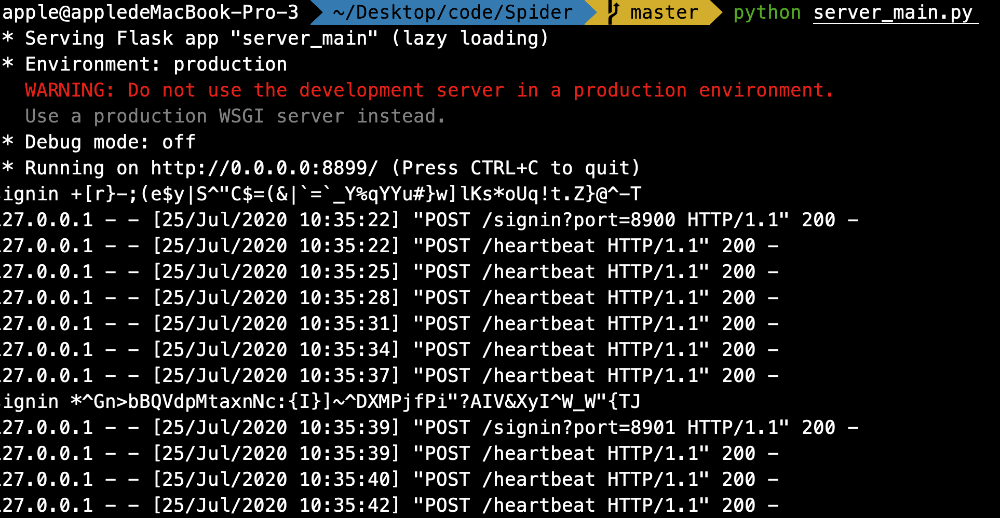

## 环境

确保安装```python3```，建议3.7以上

```
pip3 install PyQt5
pip3 install jieba
pip3 install flask
```


## 爬虫

在[MyDataHomes/Spider](https://github.com/MyDataHomes/Spider)的基础上，增加了Bilibili和知乎的数据爬虫，增加采集的内容有：

- B站用户观看历史
- B站关注UP主
- 知乎关注主题
- 知乎关注问题
- 知乎推荐问题


## 简介

用户会存储爬取的个人数据，并生成个人画像，用户上线将自己的用户画像告知服务器。

服务器可以根据不同的用户画像，将用户进行配对。

用户可以用不同的方式匹配，如同时购买了某种产品，同时关注了某个知乎问题，同时观看了某个影视作品，或者整体兴趣和行为相似。

用户可以在配对时，指定配对用户的属性，例如该用户可以指定想配对购买过iphoneX的用户（时间关系未完全实现）。

配对后的用户将进入P2P的聊天状态，聊天内容不经过服务器。


## 价值

- 私人咨询：如用户想了解新版iphone的使用体验，可指定配对购买过iphoneX的用户进行咨询
- 社交交友：可以为用户推荐校友、做特定工作、旅游区特定地点、相同爱好的用户
- 精准推荐：项目运营方可与商家合作，向指定属性的用户推荐商品


## 程序运行

服务器端运行server，默认端口为8899

```
python server_main.py
```


用户运行client，聊天监听端口可以从命令行指定

```
python client_main.py ${listening_port}
```


## 运行效果

客户端：


服务器：


